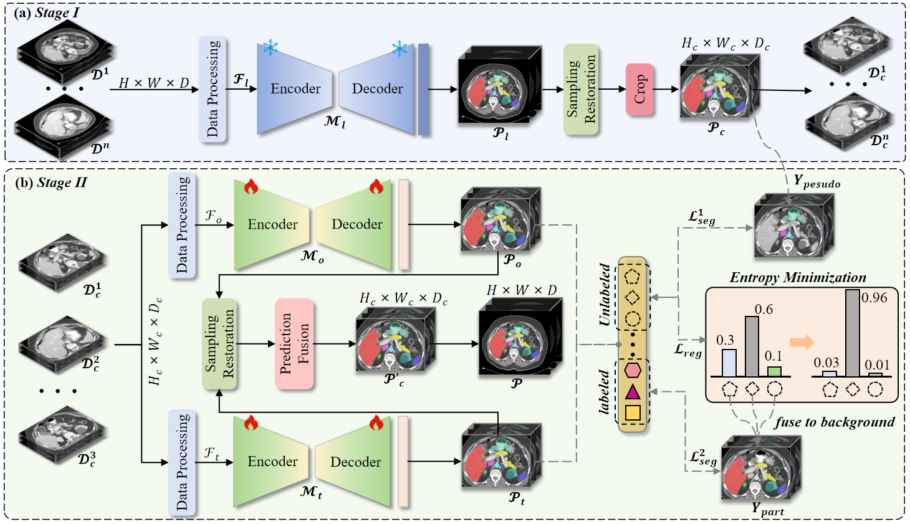
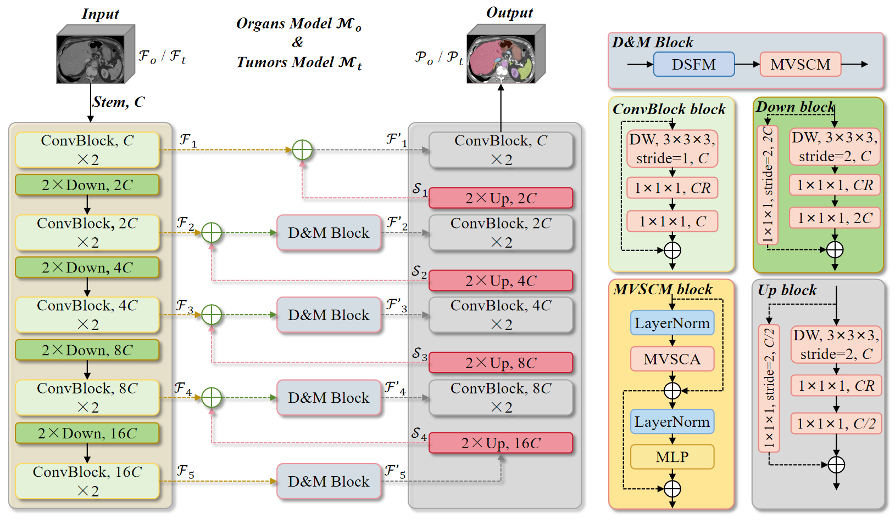

# Paper
**AMOTS: Partially Supervised Framework with Aspect-Aware Complementary for Multi-Organ and Tumor Segmentation** \
*Zengmin Zhang Yanjun Peng Xiaomeng Duan* \



The remaining model diagrams will be published after the paper is accepted.

Built upon [MIC-DKFZ/nnUNet](https://github.com/MIC-DKFZ/nnUNet), 
this paper is a continuation of our previous work [paper](https://link.springer.com/chapter/10.1007/978-3-031-58776-4_27) in [MICCAI FLARE23](https://codalab.lisn.upsaclay.fr/competitions/12239#learn_the_details-overview) Challenge.

You can reproduce our method as follows step by step:


## Environments and Requirements

- Ubuntu 20.04.3 LTS
- CPU AMD EPYC 7T83@3.50GHz
- RAM 1×90GB; 320MT/s
- GPU 1 NVIDIA RTX 3090 24G
- CUDA version 11.3
- python version 3.8.10

To install requirements:

```setup
pip install -r requirements.txt
```

## Dataset

- flare2023 [link](https://codalab.lisn.upsaclay.fr/competitions/12239#learn_the_details-dataset).
- mots [link](https://github.com/jianpengz/DoDNet).


## ROI Model
First, refer to our competition article [code](https://github.com/zzm3zz/FLARE2023) to download the ROI model code and weight files.


## Preprocessing

A brief description of the preprocessing method

- cropping:
Follow the roi model
- intensity normalization:
Follow the default method of nnU-Net
- resampling:
Organs Model: [2.5, 0.81835938, 0.81835938]
Tumor Model: [4, 1.2, 1.2]  

We use the prediction results provided by the roi model for cropping and use them as pseudo labels:

```
python nnUNet_predict -i INPUT_FOLDER  -o OUTPUT_FOLDER  -t 6  -p nnUNetPlansFLARE22Small   -m 3d_fullres \
 -tr nnUNetTrainerV2_FLARE_Small  -f all  --mode fastest --disable_tta
```

- tumor model preprocessing
```
python nnUNet_plan_and_preprocess.py -t Task_id -pl3d ExperimentPlanner3DFabiansResUNet_v21_Tumor -pl2d None
```

- organs model preprocessing
```
python nnUNet_plan_and_preprocess.py -t Task_id -pl3d ExperimentPlanner3DFabiansResUNet_v21_Organs -pl2d None
```

## Training

### 1 Train Organs Model

#### 1.1 Training Organs Model AACNet by all fold 
```
python nnunet/run/run_training.py 3d_fullres nnUNetTrainerV2_Organs organs_task_id -f all -p ExperimentPlanner3DFabiansResUNet_v21_Organs
```

#### 1.2 Training Tumor Model AACNet by all fold 
```
python nnunet/run/run_training.py 3d_fullres nnUNetTrainerV2_AMOTS_Tumor organs_task_id -f all -p ExperimentPlanner3DFabiansResUNet_v21_Tumor
```

## Inference and evaluation

First, make sure our ROI model code has been installed. Then move the ROI model folder to the same root directory as AMOTS.

To infer the testing cases, run this command:

```
python resoure_evalution.py -test_img_path path_of_the_input_volumes -temp_in inputfolder_for_individual_test_files -temp_out -o path_for_saving_the_prediction -net_roi roi_model_path -net_organs organs_model_path -net_tumor tumor_model_path
```

## Acknowledgement

> We thank the contributors of public datasets. 


